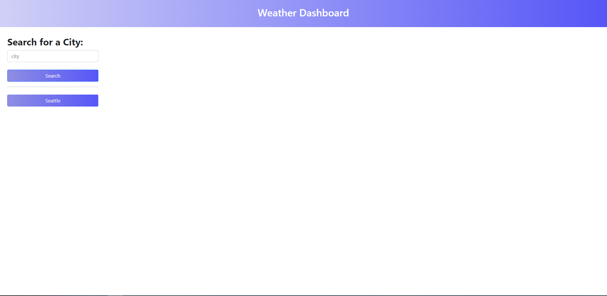
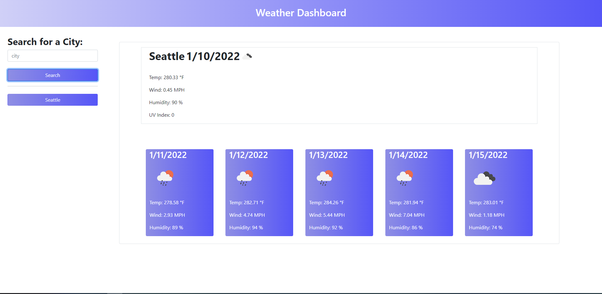
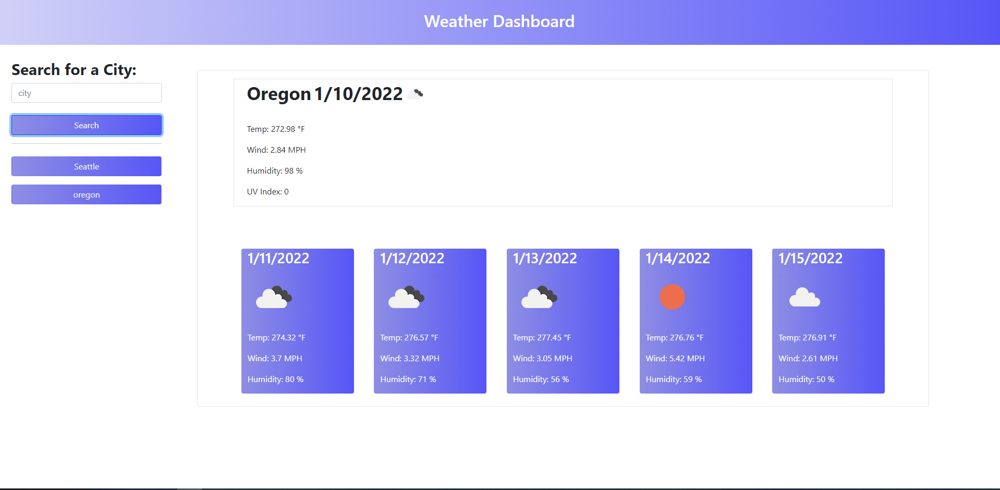
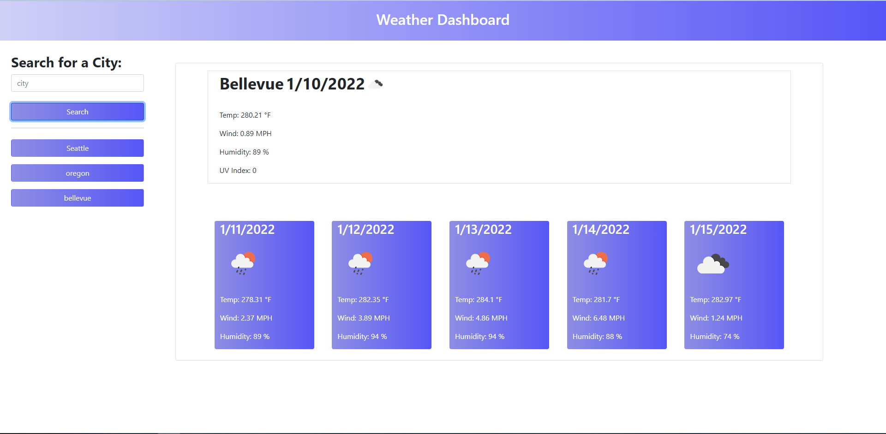
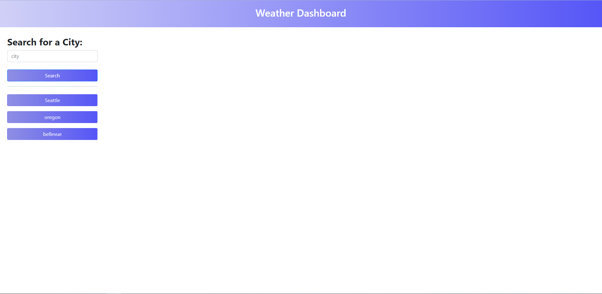

# Weather-App
## Table of Contents
1. [General Info](#general-info)
2. [Screenshots](#screenshots)
3. [Webpage link](#Webpage-link)
4. [Resources](#resources)

Author: Takara Truong
### General Info
This projects involved using javascript, HTML, and third party API's to build a weather dashboard. User will be able to type in the city of their choosing and then find the current weather and a forcast for the next five days. Users will be able to see the temperature, wind speed, humidity, and uv index for the current weather but for the forcast it does not inlcude the uv index. The past searched cities will then be listed below the search button and stored to local storage for users to re-upload that cities weather data. 

In this project, I learned espcially how to handle API calls and to extract certain data from those calls. I especially had issues in the beginning understanding fetch calls and how they worked but this function allowed be to better understand what was going on. One issue that is stil persisisting is that when the user chooses any of the past searched city buttons, it clears the rest of the cities excluding the city the user chosen. i am not sure what is going on but I woulkd like to fix this in the future. Eventually, I hope to make this page more responsive, include options for users to see maps or chose what kind of forcast they would like to see. 

### Screenshots
Weather dashboard primarly searching weather data for seattle and portland

Page layout after the page is refreshed

### Website link
https://truont2.github.io/Weather-App/

### Resources
* https://openweathermap.org/api/one-call-api#data
* https://openweathermap.org/current#name
* https://openweathermap.org/forecast5
* https://openweathermap.org/weather-conditions
* https://jsblog704552495.wordpress.com/2019/11/10/fetching-the-weather-with-openweather-api-part-1/
* https://www.tutorialspoint.com/find-current-weather-of-any-city-using-openweathermap-api-in-python

